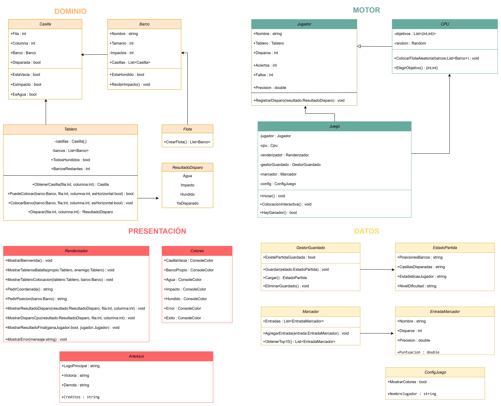

# HundirLaFlota-Sana


## Descripción del proyecto

Hundir la Flota es un juego de estrategia por turnos desarrollado como una aplicación de consola en C#.  
Dos jugadores, uno humano y una CPU, colocan su flota en un tablero de 10x10 y se turnan para disparar con el objetivo de hundir todos los barcos del rival.

Toda la interacción se realiza mediante texto en consola, utilizando caracteres ASCII y colores ANSI.  
No se utilizan librerías externas.

---

## UML

El proyecto se organiza siguiendo una arquitectura orientada a objetos dividida en cuatro capas:

- Dominio: contiene las entidades y reglas del juego
- Motor: gestiona la lógica de turnos y el flujo de la partida
- Presentación: se encarga de mostrar la información por consola
- Datos: gestiona la persistencia y configuración




## Reglas del juego

- El tablero es de 10x10  
- Los barcos se colocan en horizontal o vertical  
- No pueden salirse del tablero  
- Los barcos no pueden tocarse entre sí, ni siquiera en diagonal  
- No se puede disparar dos veces a la misma coordenada  
- Cada turno el jugador elige una coordenada (ejemplo: B7)  
- Gana el jugador que hunde todos los barcos del rival  

---

## La flota

Cada jugador dispone de los siguientes barcos:

- Portaaviones (5 casillas)  
- Acorazado (4 casillas)  
- Destructor (3 casillas)  
- Submarino (3 casillas)  
- Patrullera (2 casillas)  

Cada barco aparece una sola vez.

---

## Mecánicas del juego

El juego se divide en dos fases principales:

### Fase de colocación
El jugador coloca manualmente sus barcos en el tablero.  
La CPU coloca los suyos automáticamente en posiciones válidas.

### Fase de batalla
Los jugadores se turnan para disparar:

- Agua (~): no hay barco en la casilla  
- Impacto (X): hay un barco pero no está hundido  
- Hundido (#): todas las partes del barco han sido impactadas  

La partida termina cuando un jugador hunde toda la flota enemiga.

---

## Estructura del proyecto

El proyecto está organizado en carpetas según su responsabilidad:

src/
├── Dominio/
├── Motor/
├── Presentacion/
└── Datos/

---

## Ejecución

Para ejecutar el proyecto:

```bash
dotnet run

El programa mostrará un mensaje de prueba indicando que el proyecto se ha iniciado correctamente.
=======